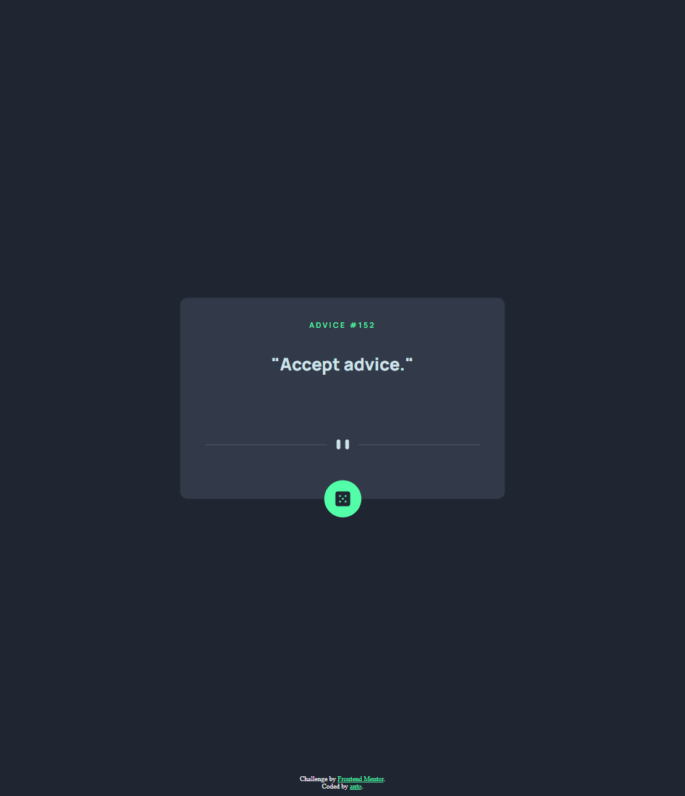
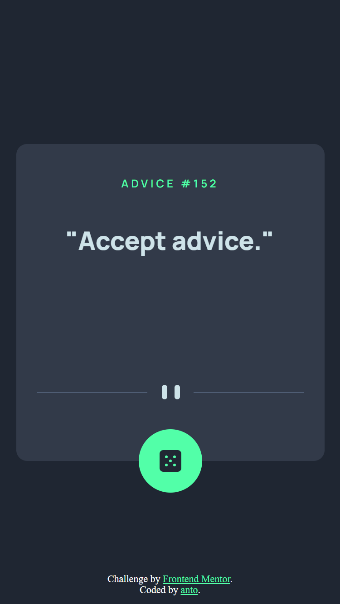

# Frontend Mentor - Advice generator app solution

This is a solution to the [Advice generator app challenge on Frontend Mentor](https://www.frontendmentor.io/challenges/advice-generator-app-QdUG-13db). Frontend Mentor challenges help you improve your coding skills by building realistic projects.

## Table of contents
- [Screenshot](#screenshot)
- [Built with](#built-with)
- [Author](#author)
- [Links](#link)

## Screenshot

## Built with

- Semantic HTML5 markup
- CSS3
- JS / ES6

## Link
- preview project: [Advice app](https://anto-b.github.io/fm-public-projects/advice-generator-app-main/)

## Author

- Website - [anto-b]
- Frontend Mentor - [@anto-b](https://www.frontendmentor.io/profile/anto-b)
