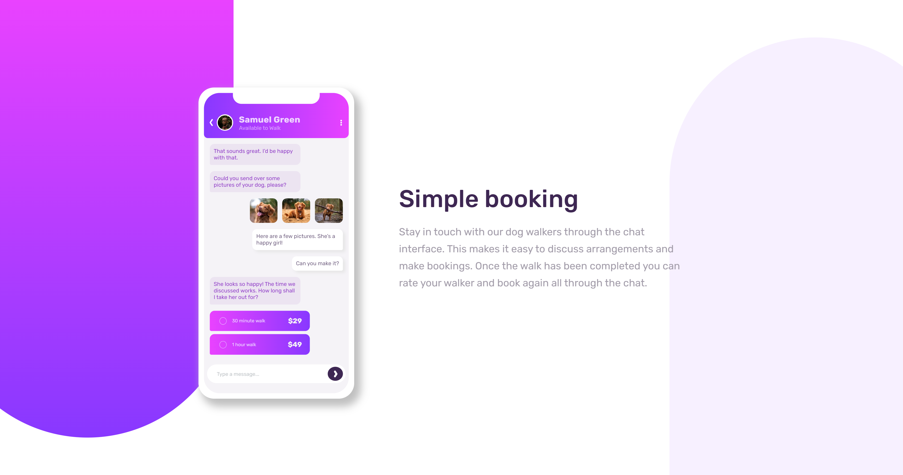
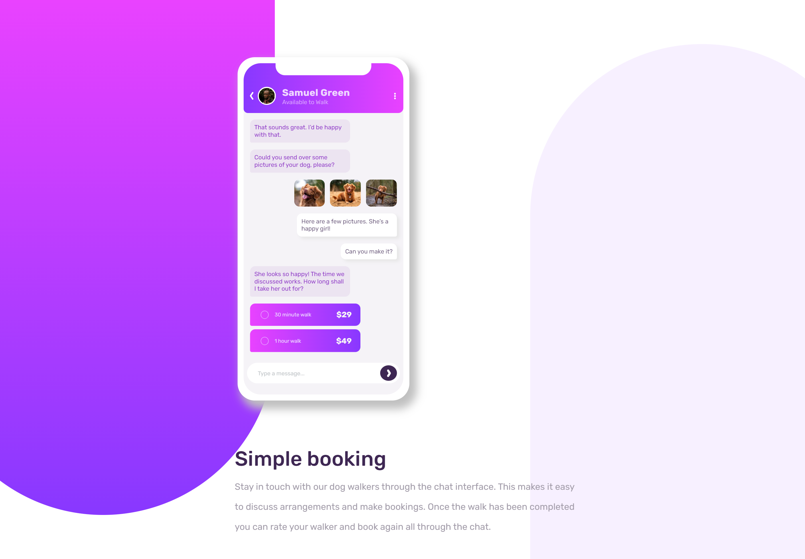
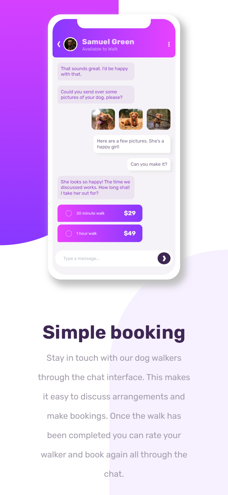
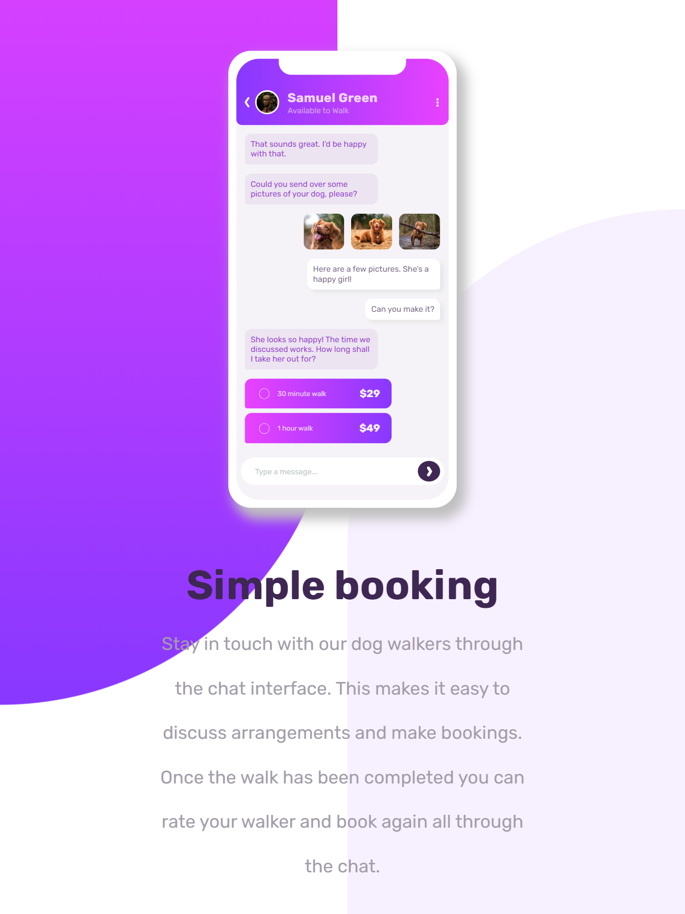

# Frontend Mentor - Chat app CSS illustration solution

This is a solution to the [Chat app CSS illustration challenge on Frontend Mentor](https://www.frontendmentor.io/challenges/chat-app-css-illustration-O5auMkFqY). Frontend Mentor challenges help you improve your coding skills by building realistic projects. 

## Table of contents

- [Overview](#overview)
  - [The challenge](#the-challenge)
  - [Screenshot](#screenshot)
  - [Links](#links)
- [My process](#my-process)
  - [Built with](#built-with)
  - [Useful resources](#useful-resources)
- [Author](#author)

## Overview

### The challenge

Users should be able to:
- View the optimal layout for the component depending on their device's screen size

### Screenshot

###### Desktop

###### Mobile

###### Tablet

### Links
- Solution URL: [Chat App Illustration](https://github.com/anto-b/fm-public-projects/tree/main/chat-app-css-illustration-master)
- Live Site URL: [Chat App Illustration](https://anto-b.github.io/fm-public-projects/chat-app-css-illustration-master/)

## My process

### Built with
- Semantic HTML5 markup
- CSS custom properties
- Flexbox
- CSS Grid

### Useful resources

- [Icons8](https://icons8.it/) - This helped me for arrow and three dots svg icon.

## Author

- Website - [anto-b](https://github.com/anto-b)
- Frontend Mentor - [@anto-b](https://www.frontendmentor.io/profile/anto-b)
