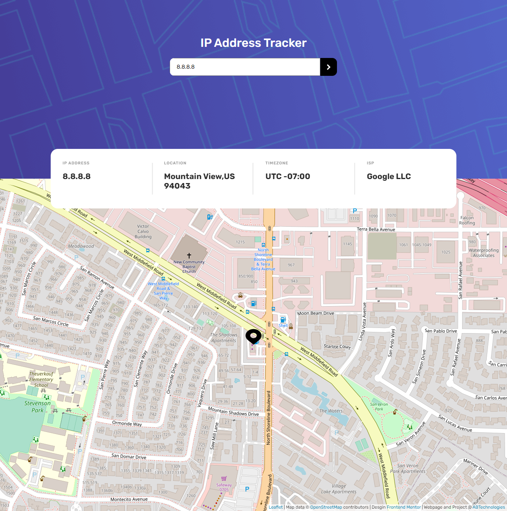
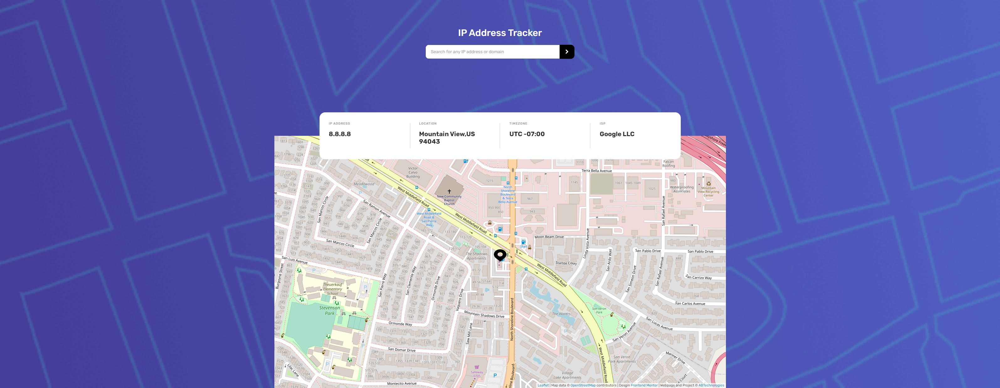
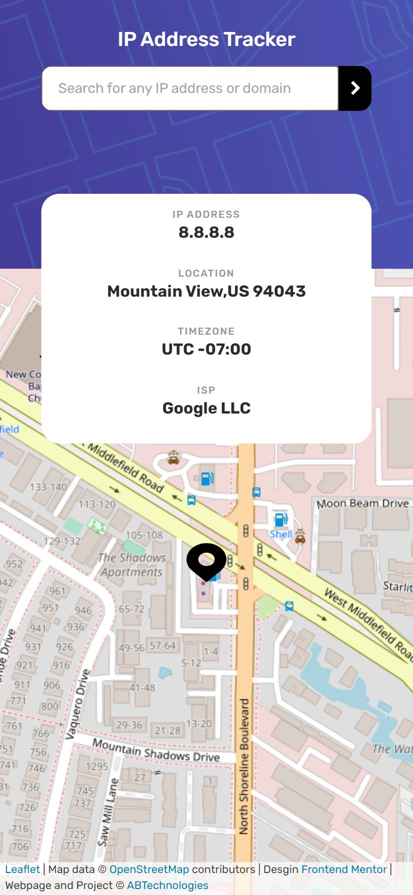
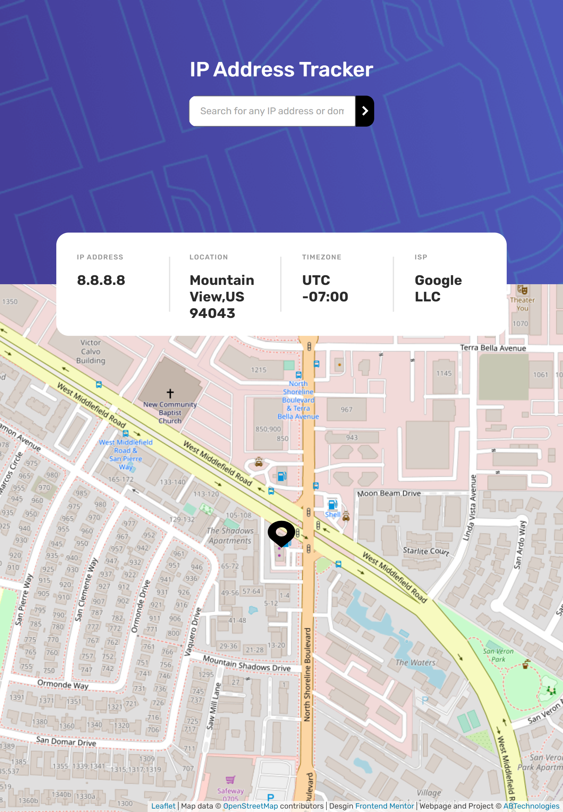

# Frontend Mentor - IP address tracker solution

This is a solution to the [IP address tracker challenge on Frontend Mentor](https://www.frontendmentor.io/challenges/ip-address-tracker-I8-0yYAH0). Frontend Mentor challenges help you improve your coding skills by building realistic projects. 

## Table of contents

- [Overview](#overview)
  - [The challenge](#the-challenge)
  - [Screenshot](#screenshot)    
    - [Desktop](#desktop)    
    - [Ultra wide desktop](#ultra-wide-desktop)    
    - [Mobile](#mobile)      
    - [Tablet](#tablet)    
  - [Links](#links)
- [My process](#my-process)
  - [Built with](#built-with)
  - [Useful resources](#useful-resources)
- [Author](#author)

## Overview

### The challenge

Users should be able to:

- View the optimal layout for each page depending on their device's screen size
- See hover states for all interactive elements on the page
- See their own IP address on the map on the initial page load
- (additional) Click on the marker and see latitude and longitude
- Search for any IP addresses or domains and see the key information and location

### Screenshot
###### Desktop:
     

###### Ultra wide desktop:  
    

###### Mobile:
    

###### Tablet:

### Links

- Solution URL: [IP tracker](https://github.com/anto-b/fm-public-projects/tree/main/ip-address-tracker-master)
- Live Site URL: [IP tracker](https://anto-b.github.io/fm-public-projects/ip-address-tracker-master/)

## My process

### Built with

- Semantic HTML5 markup
- CSS3
- Flexbox
- [Javascript](https://www.javascript.com/) - (Vanilla JS)
- XHR (asynchronous JS)
- [Leaflet](https://leafletjs.com/) - (JS Library)
- [OpenStreetMap](https://wiki.openstreetmap.org/wiki/API) - (OSM Tiles API)
- [Ipify](https://www.ipify.org/)

### Useful resources

- [Check IP Address](https://melvingeorge.me/blog/check-if-string-is-valid-ip-address-javascript) - This helped me for checking if a string is a valida IPv4 address
- [Extract hostname name from string](https://stackoverflow.com/questions/8498592/extract-hostname-name-from-string) - This is an amazing article for understanding how to extract hostname name from string

## Author

- Website - [anto-b](https://github.com/anto-b)
- Frontend Mentor - [@anto-b](https://www.frontendmentor.io/profile/anto-b)
